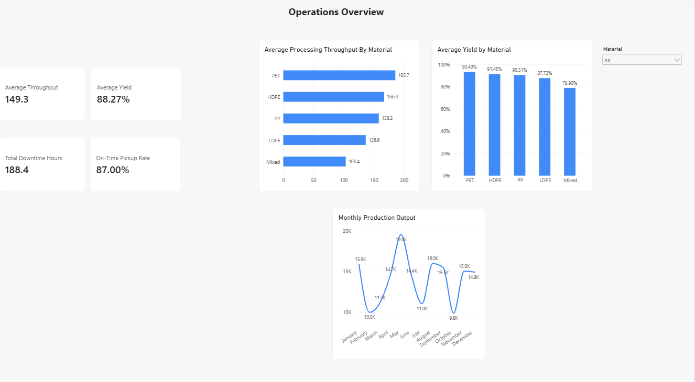
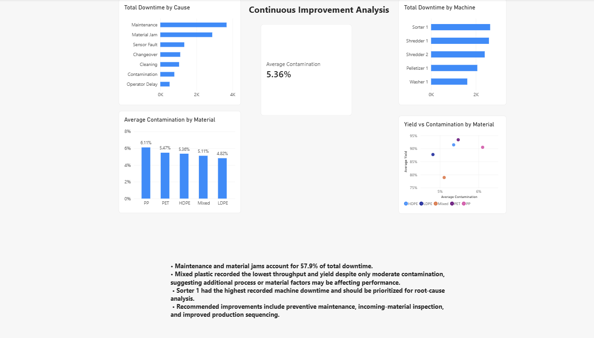

# Plastic Recycling Operations Optimization

Industrial Engineering portfolio project using **Excel, SQL, Power BI, and Lean Six Sigma** to analyze a modeled plastic-recycling operation and identify process-improvement opportunities.

> **Data note:** All operational data used in this project is synthetic. The project was inspired by recycling-facility workflows and contains no confidential company data.

## Project Objective

The project evaluates five areas of operational performance:

- Processing throughput
- Material yield
- Equipment downtime
- Quality and contamination
- Customer pickup performance

The workflow followed an end-to-end analytics process: **data preparation → Excel analysis → SQL analysis → Power BI dashboarding → continuous-improvement recommendations**.

## Key Results

| KPI | Result |
| --- | ---: |
| Average Throughput | **149.3 kg/hr** |
| Average Yield | **88.27%** |
| Total Downtime | **188.4 hr** |
| On-Time Pickup Rate | **87.0%** |
| Average Contamination | **5.36%** |

### Main Findings

- **Maintenance and material jams accounted for 57.9% of modeled downtime**, making them the highest-priority downtime categories for further investigation.
- **Mixed plastic recorded the lowest average throughput and yield**, indicating a key processing-efficiency challenge.
- **Sorter 1 recorded the highest machine downtime** and would be prioritized for root-cause analysis.
- The modeled operation achieved an **87% on-time pickup rate**.
- Contamination alone did not fully explain yield differences, suggesting additional material and process characteristics would need to be investigated before assigning root cause.

## Power BI Dashboard

### Operations Overview



The operations page tracks throughput, yield, downtime, pickup service performance, monthly production output, and material-level filtering.

### Continuous Improvement Analysis



The improvement page focuses on downtime causes, machine downtime, contamination, yield performance, and prioritized improvement opportunities.

[Download the Power BI report](dashboard/Plastic_Recycling_Dashboard.pbix)

## Excel Analysis

Excel was used for initial data preparation and operations analysis, including:

- PivotTables for throughput, yield, downtime, and pickup performance
- KPI calculations
- Data validation and reconciliation
- Pareto analysis of downtime causes
- Cumulative downtime-percentage analysis

The Pareto analysis showed that **maintenance + material jams represented 57.9% of total modeled downtime**.

[Download the Excel workbook](excel/Plastic%20Recycling.xlsx) · [View Excel documentation](excel/README.md)

## SQL Analysis

The modeled data was imported into SQLite and analyzed using seven queries covering:

1. Average processing throughput by material
2. Average yield by material
3. Total downtime by cause
4. Total downtime by machine
5. Pickup performance and on-time rate
6. Yield and contamination analysis using a `JOIN`
7. Pickup volume by customer location using a `JOIN`

[View the SQL analysis](analysis_queries.sql)

SQL techniques demonstrated include `SELECT`, `GROUP BY`, `AVG`, `SUM`, `COUNT`, `ROUND`, `ORDER BY`, subqueries, aliases, and relational `JOIN`s.

## Dataset Design

The synthetic operation was modeled using five connected datasets:

| Dataset | Purpose |
| --- | --- |
| Customers | Customer and location information |
| Pickups | Material collection and pickup-service performance |
| Processing Batches | Input/output, processing time, throughput, and yield |
| Quality Records | Contamination, rejected material, and quality status |
| Downtime Events | Equipment downtime causes and duration |

Relationships used in the analytical model:

- `customers[Customer_ID]` → `pickups[Customer_ID]`
- `processing_batches[Batch_ID]` → `quality_records[Batch_ID]`

The cleaned CSV datasets are available in [`data/`](data/).

## Supporting Results

- [Summary KPIs](results/summary_metrics.csv)
- [Downtime Pareto results](results/downtime_by_cause.csv)
- [Material performance results](results/material_performance.csv)

## Improvement Opportunities

Based on the modeled findings, the main proposed improvement areas were:

- Strengthen preventive-maintenance planning
- Investigate recurring material jams
- Standardize incoming-material inspection
- Prioritize high-downtime equipment for root-cause analysis
- Review production sequencing to reduce unnecessary changeovers and cleaning

These are **proposed opportunities from synthetic scenario analysis**, not claimed implemented company results.

## Tools & Skills

**Tools:** Excel · SQL · SQLite · Power BI · DAX

**Industrial Engineering:** KPI development · process analysis · downtime analysis · Pareto prioritization · continuous improvement · operational reporting

**Analytics:** PivotTables · relational joins · aggregation · data visualization · dashboard design · data-quality validation

## Repository Structure

```text
plastic-recycling-operations-optimization/
├── README.md
├── analysis_queries.sql
├── data/
│   ├── README.md
│   ├── customers.csv
│   ├── pickups.csv
│   ├── processing_batches.csv
│   ├── quality_records.csv
│   └── downtime_events.csv
├── dashboard/
│   ├── README.md
│   ├── operations_overview.png
│   ├── continuous_improvement.png
│   └── Plastic_Recycling_Dashboard.pbix
├── excel/
│   ├── README.md
│   └── Plastic Recycling.xlsx
└── results/
    ├── summary_metrics.csv
    ├── downtime_by_cause.csv
    └── material_performance.csv
```

---

**Project type:** Independent Industrial Engineering portfolio project using synthetic data inspired by recycling-facility operations.
